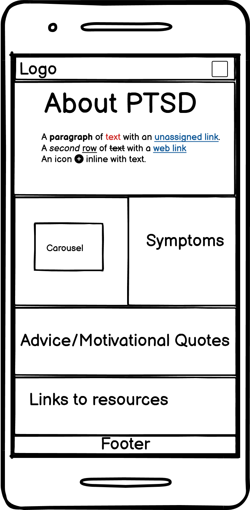
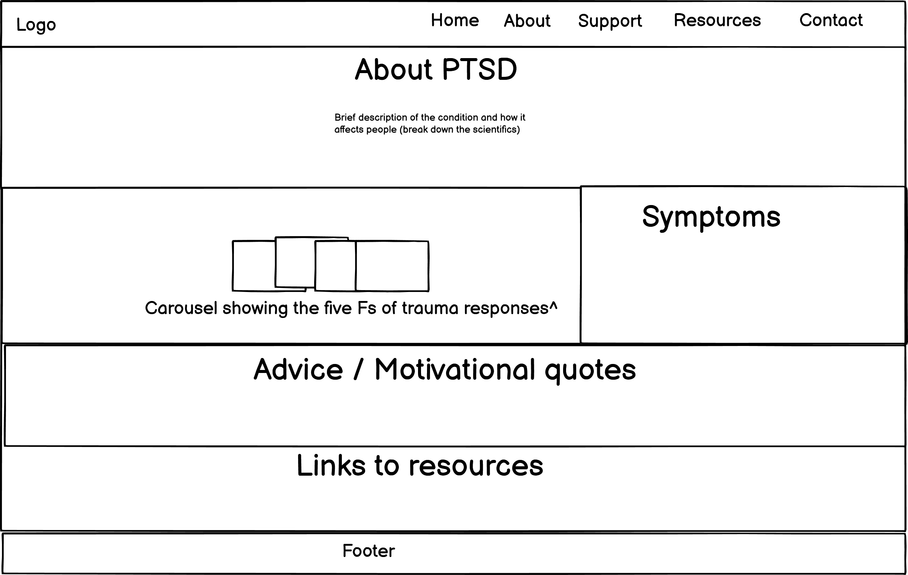
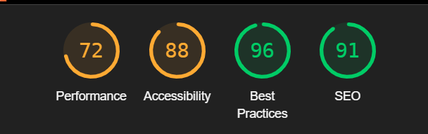

# Happier Futures

## Introduction

Happier Futures is my first individual project born from my studies of HTML and CSS with Code Institute's Full Stack Bootcamp. My desire for this project is to help spread awareness of Post-Traumatic Stress Disorder in a manner that is more digestible, especially for young survivors and their loved ones.

I chose this subject to test my newfound knowledge of HTML, CSS and Bootstrap because it is something I am passionate about and I would love to make this particular topic less frightening for those affected.

[The live site is available here](https://bmileham98.github.io/Individual-Project-PTSD/index.html)

## UX Design

### Goal

The creator designed this site to be easy to navigate and interactive, with careful thought put into making a stress-free experience for the user. Therefore the project was designed to be responsive across various devices, created with a mobile-first approach as this is the most commonly used and convenient device to search for mental health support.

### User Stories

Below are the user stories crafted for this project, the acceptance criteria and tasks may be found [here](https://github.com/users/BMileham98/projects/4) 

- As a user, I want the site to be easy to use and fully accessible to avoid further stress while navigating
- As a user, I want to learn about the fight/flight/freeze/fawn responses, so I can recognize them in myself or others.
- As a young survivor, I want simple explanations with visual support, so I can understand what's happening to me.
- As a user, I want to navigate the site easily, so I don’t feel overwhelmed or lost.
- As a young survivor, I want advice on what to do when I freeze or panic, so I can feel safer and more in control.
- As a young survivor, I want to find resources or places to get help, so I know I’m not alone.
- As a user, I want to contact the organisation so that I can provide feedback or testimonies
- As a loved one, I want to understand PTSD in young people, so I can better support someone I care about.

### Wireframes

These wireframes were created with Balsamiq, referring to the original planned designs for the site in both desktop and mobile formats. Having this basic framework made it easier to visualise the layout while I was creating it with HTML.

### Colour Scheme and Design Aesthetic

I researched colour psychology to decide the exact colour scheme I would use for this website. I found that blue and green are considered 'calming' colours and the NHS often uses these colours for that reason. Therefore I decided the colour scheme should meet the two colours half-way, therefore I decided to go with teal and other shades of bluish green. This decision was further justified when I discovered that the awareness ribbon for PTSD is teal.

To keep to a child-friendly theme I decided to use rabbits as the motif. These are prey animals that exhibit some of the same defense mechanisms we have, plus I thought it would make the topic more palpable. I could find images of rabbits to tie to each of the five fear responses I wanted to cover.

### Responsiveness

Happier Futures has been built with a mobile-first approach and as such various elements such as the carousel and navbar have been adjusted to work on a variety of screen sizes.

## Features

### Navigation Bar

The navigation bar is simple and fixed to the top of the site with padding applied to the sections so they are not hidden. It contains links to all sections and collapses on smaller screens. The active link is bold so it can be easily identified.

### About Section

The about section has a basic description of PTSD, written with simple terms so it is easier to understand and less intimidating as a result.

### 'The Five Fs' Carousel

The Five Fs section includes a carousel with captions that briefly describe each response with complimentary images, this carousel changes size based on the screen size and the follow-up paragraph sits to the side of it on these bigger screens while resting beneath on smaller screens.

### Symptoms

The symptoms section uses cards, with their height set so they are always the same height in spite of their varying amount of descriptions. These use information I researched using the PTSDUK charity website, however I have reworded the information to be more simple.
Underneath, there is a separate paragraph on dissociation in particular, which falls under Avoidance but I split apart to conserve the layout.

### Resources

The resources section is also the affirmations section. It has a text-only carousel with motivational quotes on rotation. Above this is a few sites as well as a small number of helplines for urgent help. By linking the resources, it allows me to keep the simple language used for this site while providing sites for those who want to know the science behind the condition.

### Footer
The footer is basic and doubles as a small contact section with icons that link to Facebook, X (formerly known as Twitter) and Bluesky. These are justified to the right to make it a little more tidy.

## Future Refinements

There are many things I would like to do in the future. I did not have time to implement a proper contact section and would like to make this a separate webpage with a form. 
I did not have the time to make a dedicated support page either, I would like to make this eventually and have it full of tips and even more resources to help others out.

I also wished to make my own logos, images and favicons. I did not have time to do these but I think the theme would come together nicely if I managed it. It would add a more unique charm, I think!

## Testing

I tested on multiple layouts, it is generally responsive.

### Lighthouse

My Lighthouse score was unfortunately unsatisfactory following some last minute tweaks, I would have to spend more time maybe shrinking images and minimise last minute changes to prevent it.

## Credits

I got my research from the Mind and PTSDUK sites.

My code has been partially aided by Github co-pilot and the navbar and carousel were tweaked from the bootstrap documentation. 

### AI Declaration

I have used Ai to help me fill in some info then tweaked it myself. I also used AI for some of the images. Particularly the hero image. 